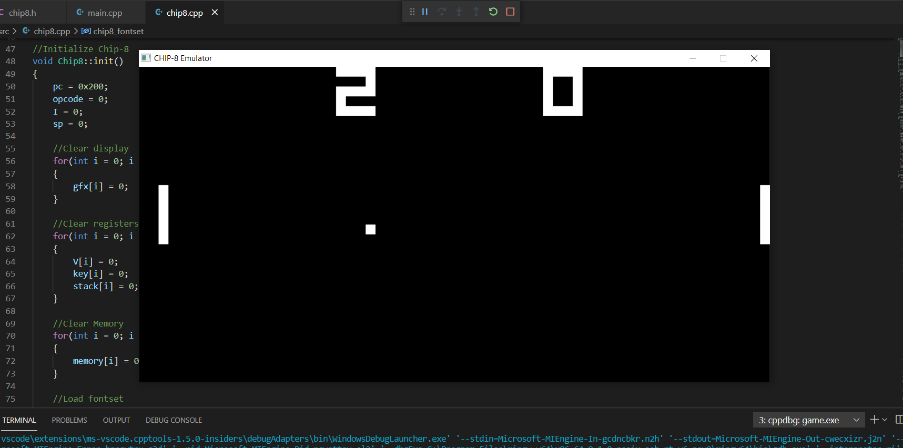
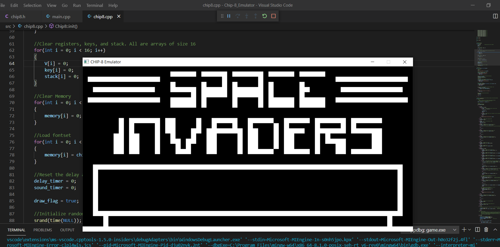
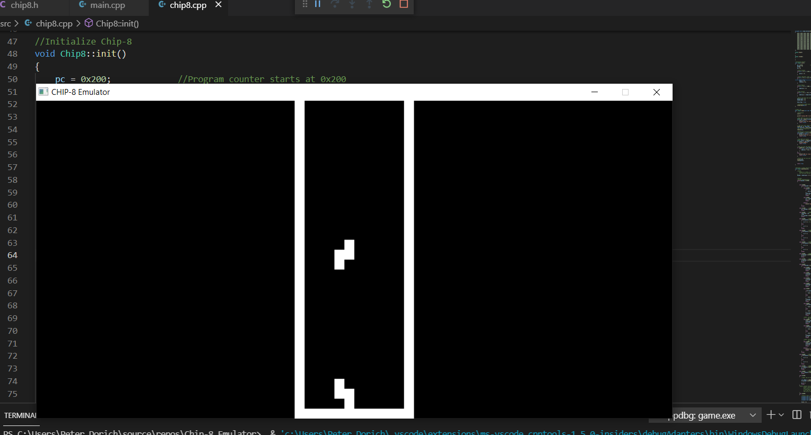

# Chip-8_Emulator

## Description

This is my implementation of a Chip-8 Emulator, written in C++. 

## Purpose

I decided to do this project to learn the basics of how emulators work and learn more about what goes on behind the scenes in emulators.
People agree that the best way to jump into programming emulators is to start with a Chip-8 interpreter. 
This project also required graphics support, so I had the opportunity to learn Simple DirectMedia Layer (SDL). 

*Screenshot of Pong Running on the Chip-8 interpreter*

*Screenshot of Space Invaders Running on the Chip-8 interpreter*

*Screenshot of Tetris Running on the Chip-8 interpreter*

## References

I used the following websites as resources to help me complete this project, including tutorials on how SDL works, an introduction to the Chip-8 system, and a Chip-8 Wikipedia page which goes over each of the opcodes and what they do.

https://lazyfoo.net/tutorials/SDL/index.php#Key%20Presses

https://multigesture.net/articles/how-to-write-an-emulator-chip-8-interpreter/

https://en.wikipedia.org/wiki/CHIP-8
